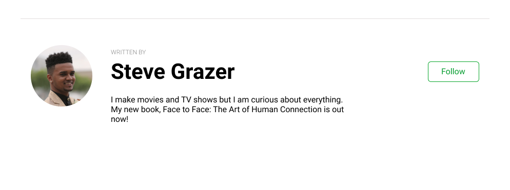

# Author bio card

Let's create an author card that can appear under a blog post for example.

Must have:

- [x] the author image is a circle
- [x] the author image is aligned to the top of the card content
- [x] the follow button is aligned with the author name

Extra:

- [x] written by label is in lighter gray and all caps
- [x] author name is noticeably bigger
- [x] card has space on top and bottom
- [x] the card has a separating line on top

Take a look at the example image:

Extra extra:

- [x] add the card in the context of a simple article page
- [x] use proper class names
